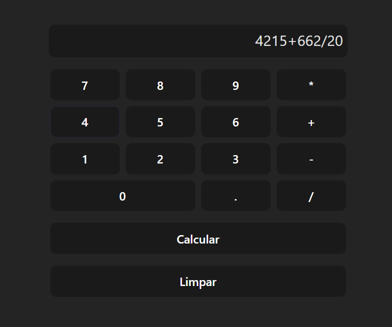

# Calculator App

A simple calculator web application developed using Vue.js, TypeScript, and Buefy.



## Table of Contents

- [Features](#features)
- [Getting Started](#getting-started)
  - [Prerequisites](#prerequisites)
  - [Installation](#installation)
- [Usage](#usage)
- [License](#license)

## Features

- Basic arithmetic operations (addition, subtraction, multiplication, division).
- Clear button to reset the input and result.
- User-friendly and responsive design.
- Implemented using Vue.js, TypeScript, and Bun.

## Getting Started

### Prerequisites

Before you begin, ensure you have the following dependencies installed:

- WSL: You can download and install WSL from [wsl website](https://learn.microsoft.com/en-us/windows/wsl/install).

- Bun: You can download and install BunJs from [bun.sh](https://bun.sh/).

### Installation

1. Clone the repository:

   ```bash
   git clone https://github.com/diuliano-vargas-silveira/Calculadora.git
   ```

2. Navigate to the project directory:

   ```
   cd Calculadora
   ```

3. Install the project dependencies:

   ```
   bun install
   ```

## Usage

1. Start the development server:

   ```bash
   bun run dev
   ``` 

2. Open your web browser and visit http://localhost:5173 to view the calculator app.

3. Use the calculator to perform basic arithmetic operations.